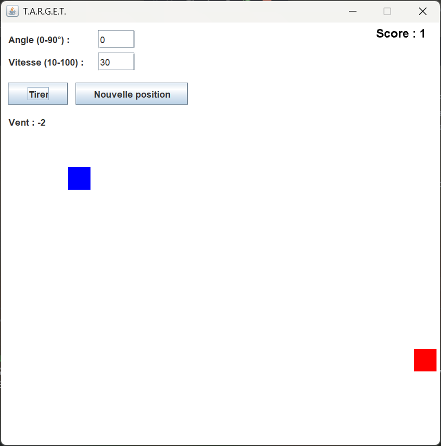
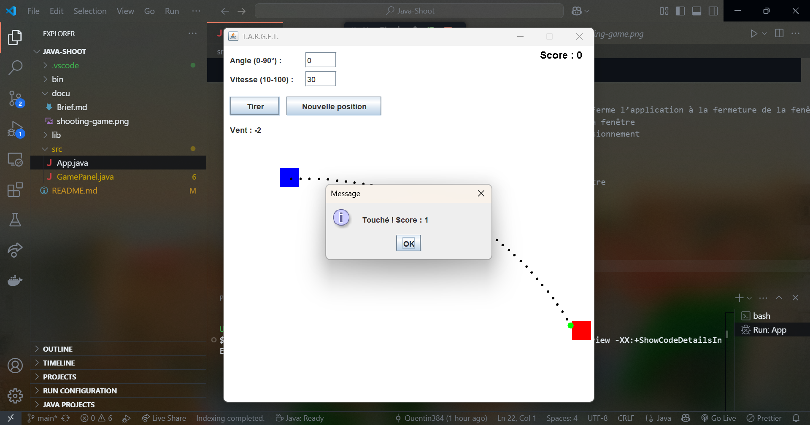
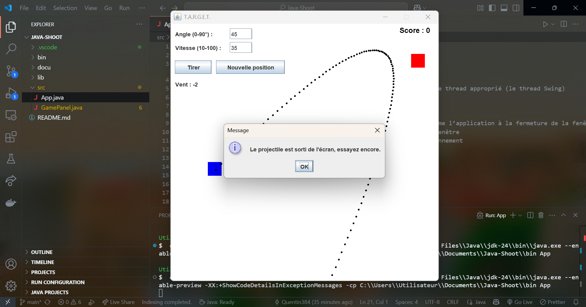

# 🎯 Jeu de Tir - Cannon Shooter

---

## 🚀 Présentation

Ce projet est une application Java simple qui simule un jeu de tir de projectile avec un canon et une cible.  
L’utilisateur choisit l’angle et la vitesse du tir, tandis qu’un vent horizontal variable affecte la trajectoire du projectile.  
Le but est de toucher la cible située à une position aléatoire dans la fenêtre.

---

## 🛠️ Fonctionnalités

- 🎯 **Canon et cible positionnés aléatoirement** dans la fenêtre de jeu  
- 🌬️ **Vent horizontal aléatoire** influant sur la trajectoire, constant entre les tirs  
- 🔫 **Tir avec angle (0-90°) et vitesse (10-100)** définis par l’utilisateur  
- 📈 **Visualisation en temps réel de la trajectoire** du projectile  
- 💥 **Détection de collision** avec la cible  
- ⚠️ **Gestion des sorties d’écran** du projectile (perte)  
- 🏆 **Score affiché et incrémenté à chaque cible touchée**  
- 🖥️ Interface graphique avec Swing (boutons, champs texte, affichage)

---

## 💻 Utilisation

- Entrer un angle entre 0 et 90 degrés  
- Entrer une vitesse entre 10 et 100  
- Cliquer sur **Tirer** pour lancer le projectile  
- Observer la trajectoire influencée par le vent affiché sous les contrôles  
- Cliquer sur **Nouvelle position** pour repositionner canon et cible, et générer un nouveau vent  
- Le score s’incrémente à chaque cible touchée

---

## 🧩 Structure du code

- `GamePanel.java` : Contient toute la logique du jeu et l’interface graphique  
- Variables pour la configuration (dimensions, taille des éléments, gravité)  
- Méthodes principales :  
  - `setupUI()` : construction de l’interface  
  - `placeCannonAndTarget()` : positionne canon et cible + génère vent  
  - `startShooting()` : initialise le tir en fonction des entrées  
  - `updateProjectile()` : met à jour la position du projectile à chaque étape  
  - `paintComponent()` : dessine tous les éléments à l’écran

---

## 🎯 Objectifs pédagogiques

- Comprendre la gestion des événements et animation avec Swing Timer  
- Manipuler la physique basique : trajectoire parabolique avec gravité et vent  
- Gestion des entrées utilisateur et validation  
- Utilisation de l’interface graphique Swing (JPanel, JButton, JTextField, JLabel)  
- Détection de collision simple avec rectangles

---

## 🤝 Contributions

Les contributions sont les bienvenues !  
- Proposer des améliorations (ex: ajout de niveaux, sons, effets visuels)  
- Signaler des bugs  
- Optimiser le code

---

## 📌 Auteur

👨‍💻 **Quentin** – Étudiant développeur Fullstack Java / Angular  
🎓 Projet réalisé en solo dans le cadre de la formation Simplon  
🎯 Rôle principal : développement complet du projet, incluant  
- la logique métier (génération de groupes, critères)  
- l’architecture frontend et backend  
- l’intégration responsive avec Angular 19  
📆 Projet solo – Mai 2025

---

## 📞 Contact

Pour toute question ou suggestion, n’hésitez pas à me contacter via GitHub.  
Bonne découverte et amusez-vous bien avec ce jeu de tir ! 🎮

---

## 📸 Capture

Ajoutez ici des captures d’écran de l’application pour illustrer l’interface ou la trajectoire du projectile.  
Cela aide à visualiser le jeu et à comprendre son fonctionnement rapidement.

  
*Vue principale du jeu*

  
*Vue de l'écran de reussite*

  
*Vue de l'écran game-over*

---